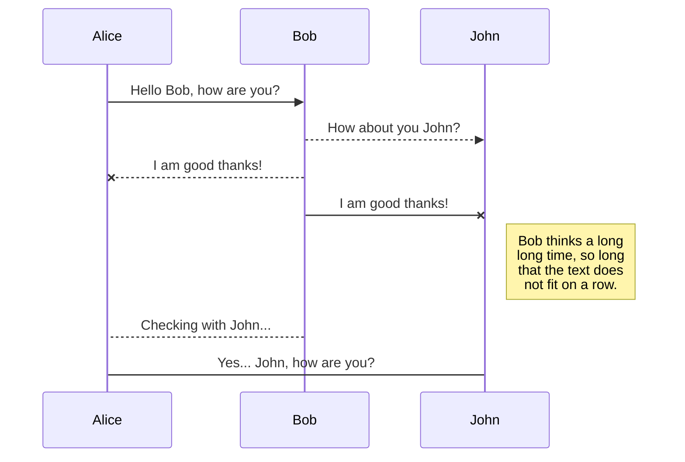
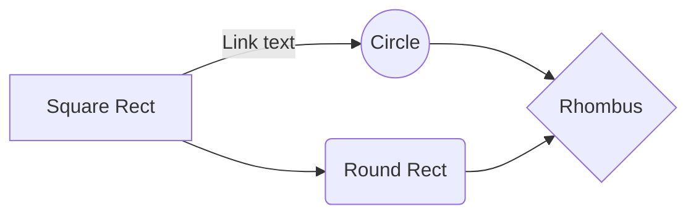

<body style="background: #d7d7d7">

</body>

Начать можно с [https://stackedit.io/app](https://stackedit.io/app#)

≡ Краткое руководство Markdown

# Заголовок h1
## Заголовок h2
### Заголовок h3
#### Заголовок h4
##### Заголовок h5
###### Заголовок h6

Абзац Markdown. Пример:

Lorem ipsum dolor sit amet... Абзацы создаются при помощи пустой строки.

Для переноса строки делаем два пробела ` ` ` ` в конце (предыдущей) строки
Перенос строки

Получается? Отлично! :+1:

Текст с жирным начертанием (**strong**) и курсив (*italic*) в Markdown:

_1 символ_ `_` или `*` для наклонного текста
__2 символа__  `__` или `**` для жирного текста
***3 символа*** `___` или `***` для наклонного и жирного одновременно.

Перечеркнутый текст. 2 тильды `~` до и после текста - текст как перечеркнутый - ~~Зачеркнуто~~

Горизонтальная черта. `hr` - 3 звездочки или 3 дефиса

***

♦ Маркированный список. Для разметки неупорядоченных списков `*`, `-`, `+`:

* текст
* текст
* текст

Вложенные пункты. 4 пробела перед маркером:

* элемент маркированного списка
* элемент маркированного списка
    * вложенный текст
    * вложенный текст

Нумерованный список. Главное, чтобы перед элементом списка стояла цифра с точкой.

1. элемент нумерованного списка
2. элемент нумерованного списка
    1. вложенный
    2. вложенный

Можно сделать так:

0. текст
0. текст
0. текст

Список с абзацами:

* Текст
* Текст
* Текст

    Текст (4 пробела или `Tab`).

---

##### ♦ Ссылки Markdown

Здесь - [ссылка с title](http://example.com/ "Привет!").

Здесь - [ссылка без title](http://example.com/).

Ссылки с разметкой как у сносок.

Здесь - [ссылка][1] продолжение текста [ссылка][2] продолжение текста [ссылка][id]. [Просто ссылка][] без указания id.

[1]: http://example.com/ "Пример Title"
[2]: http://example.com/page
[id]: http://example.com/links (Пример Title)
[Просто ссылка]: http://example.com/short

Ссылки-сноски можно располагать в любом месте документа.

---

##### Цитаты в Markdown - cимвол `>`.

> Lorem ipsum dolor sit amet.
> Lorem ipsum dolor sit amet.
>
> Lorem ipsum dolor sit amet.

В цитаты можно помещать всё что угодно, в том числе вложенные цитаты:

> ### Заголовок.
>
> 1. список
> 2. список
>
> > Вложенная цитата.
>
> Исходный код (4 пробела в начале строки):
>
>     $source = file_get_contents('example.php');

##### Исходный код в Markdown

В GFM - поставить 3 апострофа (где `Ё`) до и после кода. Можно указать язык исходного кода.

```html
<div class="as-header">
    <h1>Матрёшка</h1>
    <p>Lorem ipsum dolor sit amet.</p>
</div>
```

```javascript
    $(function() { ... });
```

Для вставки кода внутри предложений - надо обрамить в апострофы (где `Ё`).

Пример: `<div class="as-markdown">`.

Если внутри кода есть апостроф, то код надо обрамить двойными апострофами: ``Бла-бла (`) тут.``

##### Картинки в Markdown

Картинка без alt текста


Картинка с alt и title:


Картинка-ссылка:
Подсказка: синтаксис как у ссылок, только перед открывающей квадратной скобкой ставится восклицательный знак.

[](http://example.com/)

Картинки-сноски:

![Картинка][image1]
![Картинка][image2]
![Картинка][image3]

[image1]: //placehold.it/200x100
[image2]: //placehold.it/150x100
[image3]: //placehold.it/100x100

---

##### Использование HTML внутри Markdown

Mожно смешивать Markdown и HTML. Если на какие-то элементы нужно поставить классы или атрибуты, используем HTML:

> Выделим слова без помощи * и _ . Например, это <em class="as-italic">курсив</em> и это тоже <i>курсив</i>. А вот так уже <b>strong</b>, и так тоже <strong>strong</strong>.

Можно и наоборот, внутри HTML-тегов использовать Markdown.

<div class="as-markdown">

###### Markdown внутри HTML. Пример:

Выделять слова можно при помощи `*` и `_` . Например, это _курсив_ и это тоже *italic*. А вот так уже __strong__, и так тоже **strong**.

</div>

---

##### Таблицы

В чистом Маркдауне нет синтаксиса для таблиц, а в GFM есть. Рисуем:

First Header  | Second Header
------------- | -------------
Content Cell  | Content Cell
Content Cell  | Content Cell

Можно по бокам линии нарисовать:

| First Header  | Second Header |
| ------------- | ------------- |
| Content Cell  | Content Cell  |
| Content Cell  | Content Cell  |

Можно управлять выравниванием столбцов при помощи двоеточия:

| Left-Aligned  | Center Aligned  | Right Aligned |
|:------------- |:---------------:| -------------:|
| col 3 is      | какой-то текст  |   **my text** |
| col 2 is      | центр           |           $123|
| Content Cell  | бука            |         ~~$7~~|

Внутри таблиц можно использовать ссылки, наклонный, жирный или зачеркнутый текст.

---

## SmartyPants

SmartyPants converts ASCII punctuation characters into "smart" typographic punctuation HTML entities. For example:

|                |ASCII                          |HTML                         |
|----------------|-------------------------------|-----------------------------|
|Single backticks|`'Isn't this fun?'`            |'Isn't this fun?'            |
|Quotes          |`"Isn't this fun?"`            |"Isn't this fun?"            |
|Dashes          |`-- is en-dash, --- is em-dash`|-- is en-dash, --- is em-dash|


## KaTeX

You can render LaTeX mathematical expressions using [KaTeX](https://khan.github.io/KaTeX/):

The *Gamma function* satisfying $\Gamma(n) = (n-1)!\quad\forall n\in\mathbb N$ is via the Euler integral

$$
\Gamma(z) = \int_0^\infty t^{z-1}e^{-t}dt\,.
$$

> You can find more information about **LaTeX** mathematical expressions [here](http://meta.math.stackexchange.com/questions/5020/mathjax-basic-tutorial-and-quick-reference).


## UML diagrams

You can render UML diagrams using [Mermaid](https://mermaidjs.github.io/). For example, this will produce a sequence diagram:



And this will produce a flow chart:




---
♦ Для всего остального есть обычный HTML.

---

###### Links:

 * <small>[markdown-it](https://github.com/markdown-it/markdown-it) for Markdown parsing</small>
 * <small>[CodeMirror](http://codemirror.net/) for the awesome syntax-highlighted editor</small>
 * <small>[Live (Github-flavored)](https://github.com/jbt/markdown-editor) Markdown Editor</small>
 * <small>[highlight.js](http://softwaremaniacs.org/soft/highlight/en/) for syntax highlighting in output code blocks</small>
 * <small>[js-deflate](https://github.com/dankogai/js-deflate) for gzipping of data to make it fit in URLs</small>

